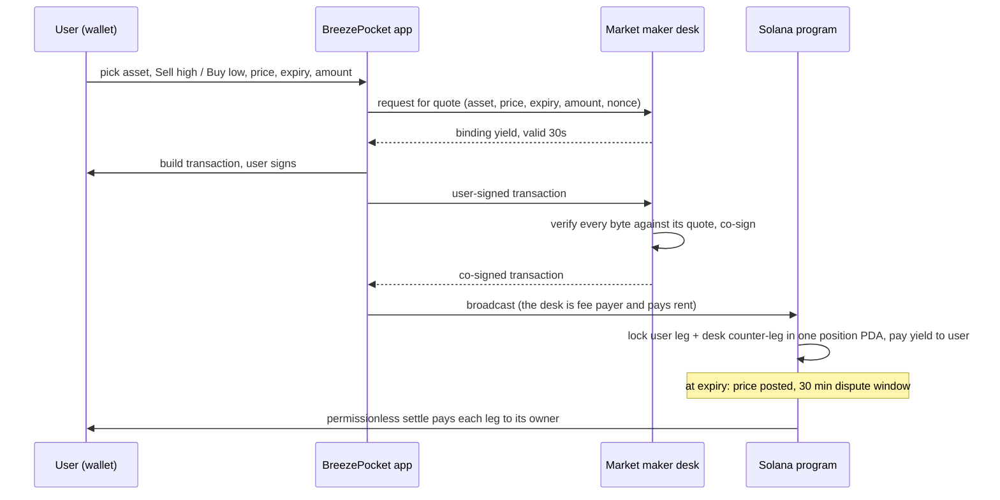

# BreezePocket

**Get paid today to sell high or buy low.** BreezePocket turns any Solana asset,
from SOL and wrapped BTC to tokenized NVIDIA stock and pre-IPO Anthropic shares, into
a yield you receive **upfront, in one transaction**, with two outcomes you agree to
before you sign.

**[Try it on devnet →](https://breezepocket-app.pages.dev)** · 25 assets tradable ·
[program on Solana Explorer](https://explorer.solana.com/address/BeytdpJYSGP1oFRxEiBLkSRGuW6HW3Pk9dqSZCuSteQ9?cluster=devnet)

---

## The problem

Solana holders sit on idle assets. Tokenized stocks, wrapped BTC and pre-IPO tokens
earn nothing in a wallet, and the institutional way to earn on them (writing fixed-price
commitments to a market maker) needs a derivatives account, margin and jargon that
retail users never touch.

Solana has no native request-for-quote rail for this. The one that existed (Convergence RFQ)
was sunset, and routing users to a centralized venue leaves them as a margined counterparty.

## The product

Two simple promises, each with exactly two outcomes, and **the yield is yours either way**:

| | **Sell high** | **Buy low** |
|---|---|---|
| You lock | the asset (e.g. 1 NVDAon) | USDC (e.g. 1,000 USDC) |
| You choose | a fixed price **above** today's | a fixed price **below** today's |
| You receive **now** | yield in the asset | yield in USDC |
| At expiry, price below / above your price | you get your asset back | you get your USDC back |
| At expiry, price crosses your price | you sold at your price, paid in USDC | you bought at your price, paid in the asset |

No liquidation, no margin, no "loss" screen: every end state is one the user picked on
the way in. A real devnet example: locking **100 USDC** to buy ANTHROPIC at **$995.92**
by 9 Oct paid **1.82 USDC upfront** in the same transaction
([tx](https://explorer.solana.com/tx/624jnokKBwFcq2VthViJAmDu7BniGz38ALynoNUVW91q85EMNYUjwRjeAYZUAFNkXWD3Ap38Z9vr1xafCY9mGEuR?cluster=devnet)).

### What you can earn on today (devnet)

| Class | Assets | Priced from | Expires |
|---|---|---|---|
| Crypto | SOL, WBTC, WETH | Deribit SOL / BTC / ETH markets | 08:00 UTC |
| Tokenized equities & ETFs | TSLAon, NVDAon, AAPLon, MSFTon, AMZNon, GOOGLon, METAon, NFLXon, COINon, MSTRon, SPYon, QQQon, XAGon (silver), PAXG (gold) | US listed markets via Alpaca | 20:00 UTC (the New York close) |
| Pre-IPO | ANTHROPIC, OPENAI, SPACEX, ANDURIL, NEURALINK, FIGUREAI, KALSHI, POLYMARKET | PreStocks token price | 08:00 UTC |

Adding an asset is one governance transaction (`list_asset`); the market maker picks it
up automatically.

## How it works



1. **Quote.** The desk prices each commitment from the deepest market for that asset
   (Deribit for crypto, US listed markets for equities) and answers with a binding yield.
2. **Lock, atomically.** One dual-signed transaction moves the user's collateral **and**
   the desk's full counter-leg into a program-owned PDA and pays the yield upfront.
   The desk is the fee payer, so users need no SOL at all.
3. **Settle, trustlessly.** After expiry a price poster records the reference price; after
   a 30-minute dispute window **anyone** can call `settle`, which pays both legs out.

### Why users can trust it

- **Fully collateralized, both sides.** The desk locks the entire other leg at open, so
  the user's payout is already on chain. There is nothing to liquidate and no credit risk.
- **Atomic.** Collateral, counter-leg and yield move in a single transaction or not at all.
- **The desk can't redirect funds.** Every account in the transaction is a PDA or
  associated token account the program derives and checks; the desk also re-derives
  and verifies every byte before co-signing.
- **Replay-proof.** A per-quote nonce is part of the position address, so a quote can
  be used exactly once.
- **Governance safety valve.** A 3-of-5 multisig can correct a bad posted price or
  emergency-cancel a position, which returns each side its own collateral. The price
  poster alone cannot settle anything until the 30-minute dispute window has passed.
- **Settlement never blocks.** Stray deposits to a vault go to the desk, missing token
  accounts are created on the fly, and vault rent is refunded.
- **0% protocol fee** today: users receive the desk's full price as yield.

### Why Solana

Fast confirmation makes a 30-second binding quote practical; cheap transactions let the
desk pay every fee and rent so users never need gas; and Solana is where tokenized
equities and pre-IPO tokens already trade, so the collateral is native, with no bridge.

## Architecture

| Repo | What it is |
|---|---|
| [**core**](https://github.com/BreezePocket/core) (this repo) | Anchor program, LiteSVM test suite, ops scripts |
| [**MM-system-breezepocket**](https://github.com/BreezePocket/MM-system-breezepocket) | Market-maker desk: live pricing, RFQ, transaction verification and co-signing, exposure caps, devnet faucet |
| [**dashboard-breezepocket**](https://github.com/BreezePocket/dashboard-breezepocket) | React app: earn list, trade flow, positions dashboard with one-click settle |

The market-maker interface is open by design: any desk that answers the same RFQ and
co-sign messages can quote. At launch a house desk runs it with hard notional caps per
position, per expiry and in total.

## Status

| Done | Next |
|---|---|
| Program live on devnet with SOL and 24 listed SPL assets | Automated settlement job posting reference prices at each expiry |
| Desk quoting and co-signing every listed asset | Aggregator routing each quote request to multiple desks, best yield wins |
| Web app: trade, faucet, positions and settle | Real mainnet mints (incl. Token-2022 support for tokenized equities) |
| 70 program tests, 73 desk tests | Audit, then mainnet with capped house desk |

---

## For developers

Program ID (all clusters): `BeytdpJYSGP1oFRxEiBLkSRGuW6HW3Pk9dqSZCuSteQ9`. The product
spec and build plan live in [`docs/`](docs).

### Layout

```
programs/breezepocket/src
  lib.rs                          instruction entrypoints
  state/mod.rs                    GlobalConfig, positions, settlement prices, AssetConfig, helpers
  errors.rs                       error codes
  instructions/
    initialize_config.rs          one-time governance list, price poster, USDC mint
    open_position.rs              SOL: dual-signed atomic lock + upfront yield (MM pays fee + rent)
    list_asset.rs                 3/5 governance lists an SPL token (mint, symbol, expiry time of day)
    open_asset_position.rs        the same lock for a listed token; both legs held as tokens
    post_settlement_price.rs      price poster records the SOL delivery price
    asset_settlement_price.rs     poster post + governance override for listed assets
    settle.rs                     permissionless SOL settlement after the dispute window
    settle_asset_position.rs      permissionless settlement for listed assets
    emergency_cancel.rs           3/5 governance returns both legs (SOL)
    emergency_cancel_asset_position.rs  same for listed assets
    override_settlement_price.rs  3/5 governance sets the SOL price, no dispute window
    payout.rs                     shared kept / exchanged distribution
tests/                            LiteSVM suite (in-process SVM with a movable clock)
scripts/                          create-test-usdc, initialize-config, list-assets, post-settlement-price, settle
```

### Position economics

| | Sell high (`SellSol`) | Buy low (`BuySol`) |
|---|---|---|
| User locks | `amount` of the asset | `amount` USDC |
| Market maker locks | `amount × fixed_price` USDC | `amount ÷ fixed_price` of the asset |
| Yield paid upfront | in the asset | in USDC |
| kept (price below / above fixed) | asset back to user, USDC back to MM | USDC back to user, asset back to MM |
| sold / bought (price crosses fixed) | asset to MM, USDC to user | USDC to MM, asset to user |

Prices are USDC base units (6 decimals) per whole token. SOL legs are lamports on the
position PDA; token legs sit in the position's associated token accounts, closed at
settlement with rent refunded to the market maker. Each listed asset has its own expiry
time of day and its own settlement prices, keyed by mint and expiry. USDC itself cannot
be listed.

### Build and test

The bundled Solana platform-tools (v1.51, cargo 1.84) cannot read the edition-2024 crates
Anchor 0.32 pulls in, so the SBF build pins platform-tools v1.53 and generates the IDL
in a second step:

```bash
npm install
npm run build          # anchor build --no-idl -- --tools-version v1.53 && anchor idl build
npm test               # 70 LiteSVM tests: every instruction × every outcome and guard
cargo clippy -p breezepocket -- -D warnings
```

Plain `anchor build` / `anchor test` fail on the toolchain error until the platform-tools
default catches up; use the npm scripts.

### Devnet deployment

| | |
|---|---|
| Program | `BeytdpJYSGP1oFRxEiBLkSRGuW6HW3Pk9dqSZCuSteQ9` (upgrade authority: the deploy wallet) |
| GlobalConfig | `BejjQ3MwvvFwaP3FxyDjj7Cu4gBMrH5Txr5xuCR32THp` |
| Test USDC mint | `GxSfF7CfT3C2Sr7RYFwXoRHmhFeH4DpUVQCDNiktxEFD` (6 decimals) |
| Listed assets | 24 test mints, 9 decimals, mint authority: the deploy wallet (`npm run list-assets`) |
| Price poster | `HrWpKo9dzLTurZh14ArK5XPsZZ1CHQM1SDzpB4j2XdPY` (`keys/price-poster.json`) |
| Governance | `keys/governance-1..5.json` (gitignored) |

The public devnet RPC rate-limits program uploads; deploy through a keyed RPC with
`--use-rpc`. HTTP-only RPCs lack `signatureSubscribe`, so the scripts route subscriptions
to `SOLANA_WS`, and free tiers that block `getProgramAccounts` (e.g. Alchemy) can point
scans at `SOLANA_SCAN_RPC`.

### Deploy to a new cluster

```bash
anchor deploy --provider.cluster devnet
export SOLANA_RPC=<rpc url>

# 1. Test USDC (no canonical USDC off mainnet), funded to the desk and a test user
npm run create-test-usdc -- --mint-to <MM_PUBKEY>,<USER_PUBKEY> --amount 100000

# 2. GlobalConfig: 5 governance keys + price poster (keys/ is gitignored)
npm run init-config -- --usdc-mint <MINT> --generate-keys keys/

# 3. List assets as SYMBOL@HH:MM (UTC expiry time); on test clusters this creates the mints
SOLANA_SCAN_RPC=https://api.devnet.solana.com \
  npm run list-assets -- --assets NVDAon@20:00,WBTC@08:00 --mint-to <MM_PUBKEY> --amount 1000000
```

Point the desk (`MM-system-breezepocket`) at the same RPC, program and USDC mint; it reads
the listings from chain. Its `simulate-user` script opens a position end to end.

### Settle manually

Until the settlement job is automated, it is two scripts:

```bash
# after expiry, with the reference price for that expiry
WALLET=keys/price-poster.json npm run post-price -- --expiry <unix_ts> --price 212.35
WALLET=keys/price-poster.json npm run post-price -- --asset NVDAon --expiry <unix_ts> --price 181.20

# 30 minutes later; anyone can call settle
npm run settle -- --expiry <unix_ts>          # every open position at that expiry, SOL and listed assets
npm run settle -- --position <pubkey>         # one position
```

### Deviations from the spec

- `GlobalConfig` carries `usdc_mint` so the program validates USDC accounts on every
  cluster.
- The spec's success criterion sends the MM's collateral back to the MM on sold/bought,
  which would leave the user unpaid; the MM collateral is the counter-leg and goes to the
  user when the exchange happens (table above).
- Settlement prices are keyed by the priced asset and expiry, so Sell high and Buy low
  positions at one expiry share one posted price.
- Beyond the spec's SOL-only v1, governance can list SPL assets, each with its own
  expiry time of day.
